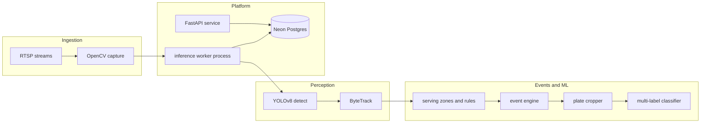

# Buffet MVP — phased architecture (FastAPI + Neon)

## What the MVP document commits to

The doc defines an eight-step pipeline and core modules:

- **Ingestion**: RTSP CCTV streams.
- **Perception**: OpenCV frames → **YOLOv8** (person + plate) → **ByteTrack** (stable plate IDs).
- **Semantics**: **Event engine** (serving zone + person presence + dwell time, e.g. > 2s) → **plate crops** → **multi-label** food classifier (sigmoid + BCE; multiple items per plate).
- **Output**: stored events + API (your stack choice: **FastAPI** + **Neon Postgres**).

Business constraints implied by the doc: operational reliability over novelty, manual labeling for training, and “after-serving” plate images first to reduce label ambiguity.

---

## Agile delivery model (tracking and continuous improvement)

Work is organized in **short time-boxed sprints** (recommended: **1–2 weeks**) so each sprint produces a **working increment** you can demo, measure, and improve—rather than a single big bang at the end.

### How phases map to Agile artifacts

- **Epics** (large bodies of work): align 1:1 with **Phase 0–6** below. Each epic breaks down into **user stories** and **technical tasks** in the product backlog.
- **Sprints**: pick a realistic slice from one or more epics based on capacity. It is normal for **Phase 3** or **Phase 4** to span **multiple sprints**; split by vertical slices (e.g. “zones + persist events without classifier” then “tune dwell + debounce”).
- **Product backlog**: single ordered list (Neon schema, worker, API, ML). Re-prioritize each sprint based on learnings.
- **Sprint backlog**: only what the team commits to for the sprint; keep it small enough to finish.

### Ceremonies (lightweight, fit-for-MVP)

| Ceremony | Purpose |
| -------- | ------- |
| **Sprint planning** | Pull backlog items; agree sprint goal; define acceptance criteria per story. |
| **Daily standup** (optional 15m) | What’s done / blocked / next; unblock ingestion or GPU issues fast. |
| **Sprint review** | Demo the increment (e.g. live stream heartbeat in DB, or events appearing after zone draw). |
| **Retrospective** | What to improve next sprint: process, **code structure**, tests, observability. |

### Definition of Done (suggested)

Each story is “done” when: behavior matches acceptance criteria; **lint/format** clean; **tests** where they add value (unit for pure logic, clip-based tests for CV); merged to main; **migrations** applied on dev Neon; and any known limitations documented in the backlog (not only in chat).

### Continuous code improvement

- **Every sprint**: reserve capacity for **refactoring**, **test hardening**, and **one** retro-driven improvement (e.g. clearer module boundaries between `worker/` pipeline stages).
- **After each phase epic**: short **stabilization** pass—reduce duplication, tighten types, add integration smoke test—before piling on the next epic.
- **Technical debt**: visible backlog items (not hidden “TODOs only”), prioritized against features.

### Example sprint sequence (illustrative)

Adjust lengths to your team; this ties **sprints** to **technical phases**:

| Sprint | Focus | Typical increment |
| ------ | ----- | ------------------- |
| S1 | Phase 0 + start Phase 1 | Repo, Neon, migrations, `/health`/`/ready`; ingest loop with logs |
| S2 | Phase 1 completion | Reconnect/FPS/heartbeats stable on a real RTSP or file stand-in |
| S3 | Phase 2 | YOLO + ByteTrack on recorded clips; baseline metrics |
| S4 | Phase 3 (part 1) | Zones in DB + FSM; events persisted |
| S5 | Phase 3 (part 2) | Tuning dwell/debounce; debug snapshots |
| S6 | Phase 4 | Crops + multi-label path + `model_versions` |
| S7 | Phase 5 | FastAPI queries and admin flows |
| S8 | Phase 6 | Evaluation harness, load checks, training-data loop |

This is a **planning guide**, not a fixed calendar; retros should re-estimate Phase 4–6 (labeling and tuning often dominate).

---

## High-level system architecture

Split responsibilities so GPU/CPU-heavy work never blocks HTTP:

- **Inference worker**: long-running process (or multiple workers per camera). Owns RTSP, OpenCV, YOLO, ByteTrack, event FSM, cropping, optional batching to classifier.
- **FastAPI service**: auth (later), REST (and optional WebSocket for live dashboards), read/write boundaries for clients; **does not** decode RTSP in request handlers.
- **Neon**: single source of truth for tenants/sites, cameras, calibration (zones), **serving_events**, optional **classification_results**, **model_versions**, and **training_sample** pointers (S3/local paths if you store crops elsewhere).

Communication options (pick one in Phase 1 and stay consistent):

- **Simple MVP**: worker writes directly to Neon; API reads Neon only.
- **Scale path**: worker enqueues jobs to Redis/SQS; API publishes config; still persists final state in Neon.

---

## Data model (Neon / Postgres) — minimal tables

Design for multi-site from day one (cheap in SQL, painful to retrofit):

- **organizations**, **sites**, **cameras** (rtsp_url, status, fps target).
- **zone_definitions** (camera_id, polygon or normalized rect JSON, zone_type e.g. `serving`, metadata).
- **serving_events** (camera_id, plate_track_id, started_at, ended_at, dwell_ms, snapshot_uri optional, confidence aggregates).
- **plate_classifications** (event_id or crop_id, labels JSONB or join table `label_scores(label, score)`), **model_version** FK.
- **metrics_rollup** (optional, for dashboards: hourly counts per label).

Use **SQLAlchemy 2.0** + **asyncpg** (or `databases` + raw SQL) against Neon’s connection string; prefer **connection pooling** appropriate for serverless (Neon docs: pool from the app, avoid opening a new connection per frame).

---

## Phase 0 — Project foundation and Neon

- Monorepo-style layout: `app/` (FastAPI), `worker/` (ingestion + CV), `shared/` (Pydantic models, DB models, constants).
- Tooling: `pyproject.toml` or `requirements.txt`, `ruff`/`black`, `.env` for `DATABASE_URL` (Neon).
- Neon: create project + branches (dev/prod), run initial Alembic migrations for the tables above.
- **Definition of done**: FastAPI `/health` + `/ready` (DB ping); empty tables; migration reproducible.

---

## Phase 1 — RTSP ingestion and frame loop (no ML yet)

- Robust **OpenCV** capture with reconnect/backoff, frame skipping to hit target FPS, timestamp alignment (wall clock vs stream PTS).
- Structured logging (camera_id, frame_id, latency).
- Persist **heartbeat** rows or metrics so ops know a stream is alive.
- **Batch folder mode**: `VIDEO_SOURCE` may point at a directory of ten sequentially named clips (`BATCH_101` … `BATCH_110`) for ordered offline runs; see `video_samples/README.md`. Live RTSP backlog and reconnection behavior remain the primary production path.

Aligns with doc pipeline steps **1–2**.

---

## Phase 2 — Detection (YOLOv8) and tracking (ByteTrack)

- Integrate **Ultralytics YOLOv8** for **person** and **plate** classes; filter by confidence and NMS.
- Wire **ByteTrack** (or equivalent) to maintain **track_id** per plate across frames.
- Unit-test tracking on short recorded clips (fixtures) before live RTSP.
- Use the **batch folder** workflow (`BATCH_101` … `BATCH_110` under one `VIDEO_SOURCE` directory) so each clip gets a **fresh** tracker and event state; optional `WORKER_MAX_FRAMES` caps frames **per clip** for smoke tests.

Aligns with doc steps **3–4** and **Core Modules → Detection/Tracking**.

---

## Phase 3 — Calibration, zones, and event detection engine

- **Calibration UX (MVP manual)**: store polygon/rectangle in DB as JSON; optional small admin endpoint or seed script to set zones per camera.
- **Event FSM per plate track** (conceptually):
  - Enter serving zone + person nearby/overlapping (IoU or centroid distance rule).
  - Dwell timer > threshold (doc: e.g. 2 seconds).
  - Emit **serving_event** on stable exit or on timeout rules; debounce duplicate fires.
- Persist raw event geometry optionally (bbox snapshots) for debugging.

Aligns with **Serving Detection Logic** and step **5**.

---

## Phase 4 — Plate cropping and multi-label classification

- **Cropper**: expand plate bbox, aspect fix, resize to classifier input; handle occlusion (doc risk) by minimum visible area checks.
- **Classifier**: PyTorch model with **sigmoid + BCEWithLogitsLoss**; expose `predict_proba` > tuned thresholds; store top-k and full vectors in JSONB if needed.
- **Model registry**: `model_versions` table (path, metrics, created_at); worker loads version from config.
- **Data strategy from doc**: prioritize **post-serving** crops for labeling tooling; version your label schema.

Aligns with steps **6–7** and **Multi-Label Classification Details**.

---

## Phase 5 — FastAPI surface and integration with Neon

Resource-oriented API (examples):

- `GET /sites`, `GET /cameras`, `POST /cameras/{id}/zones` (admin).
- `GET /events` with filters (time range, site, camera, label).
- `GET /events/{id}` with classification breakdown.

Implementation notes:

- **Async DB** sessions per request; no long transactions.
- **Pagination** and indexes on `(camera_id, started_at)` for events.
- Optional **WebSocket**  `/streams/{camera_id}/events` pushing new rows (Postgres `LISTEN/NOTIFY` or poll) — defer to Phase 6 if timeboxed.

Aligns with step **8** (**Data Storage & API Output**), substituting PostgreSQL with **Neon**.

---

## Phase 6 — Quality, evaluation, and operations

- **Offline evaluation** per doc: detection P/R, multi-label F1, event-level accuracy vs labeled clips.
- **Synthetic load**: API k6/locust; worker memory/CPU profiling.
- **Risk mitigations** called out in doc: lighting aug in training, hard negatives for similar foods, mixed-dish handling via multi-label.
- **Future enhancements** (doc): portion estimation, segmentation, Streamlit/Grafana dashboards, POS integration — treat as post-MVP tracks.

---

 Suggested mapping from the document’s **Implementation Roadmap**

| Doc timeline                  | Phases above                       |
| ----------------------------- | ---------------------------------- |
| Day 1–2 Stream + detection    | Phases 0–2                         |
| Day 3 Tracking + zones        | Phase 3 (tracking refined + zones) |
| Day 4 Event capture           | Phase 3 (persistence + tuning)     |
| Day 5 Classification + output | Phases 4–5                         |

The doc’s five-day plan is optimistic for training data and tuning; Phases 4–6 explicitly include **labeling workflow**, **threshold tuning**, and **evaluation**, which usually dominate calendar time.

---

## Key decisions to lock early

1. **Worker ↔ API coupling**: direct DB writes (simplest) vs message queue (cleaner at scale).
2. **Where crops live**: DB bytea (avoid for MVP volume) vs object storage vs local disk path + DB reference.
3. **Multi-tenant auth**: defer OIDC/API keys until first external consumer; structure DB for tenants now.

---

## Deliverables checklist

- Runnable **worker** + **FastAPI** with shared **Neon** schema.
- Reproducible migrations and `.env.example`.
- Documented **zone format** and **event FSM** (short internal README only if you choose — you did not request new markdown files in-repo; keep in issue/PR description if avoiding extra docs).
- Evaluation notebook or script for **multi-label F1** and **event accuracy** on a fixed validation set.

## Short backlog
- BL-RTSP-01: Stabilize/live-tune RTSP (H.264 substream when NVR access returns, TCP transport, Ethernet, investigate 30s OpenCV timeouts, reduce bitrate/FPS).
